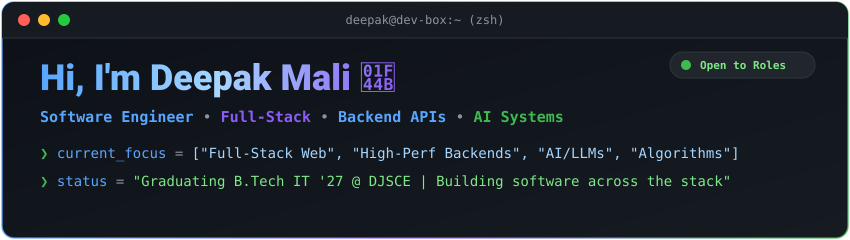
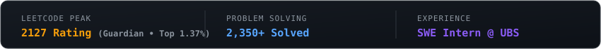

  

<!-- COMPACT STATS & ABOUT -->

  

<blockquote align="center">
  <strong>Software Engineer / Builder</strong> • Final-Year IT @ DJSCE • Ex-SWE Intern @ <strong>UBS</strong> 
  Crafting full-stack web apps, scalable backend APIs, & distributed systems with Java, Python, TS, & AI tech.
</blockquote>

  

### 🛠️ Tech Stack

  

  

### 🏆 Competitive Programming & Metrics

   &nbsp;
   &nbsp;
  

<table width="100%">
  <tr>
    <td width="50%" align="center">
      
    </td>
    <td width="50%" align="center">
      
    </td>
  </tr>
</table>

<!-- FOOTER / CONNECT -->

   &nbsp;
   &nbsp;
  
   
  Designed & Built by Deepak Mali • 2026

